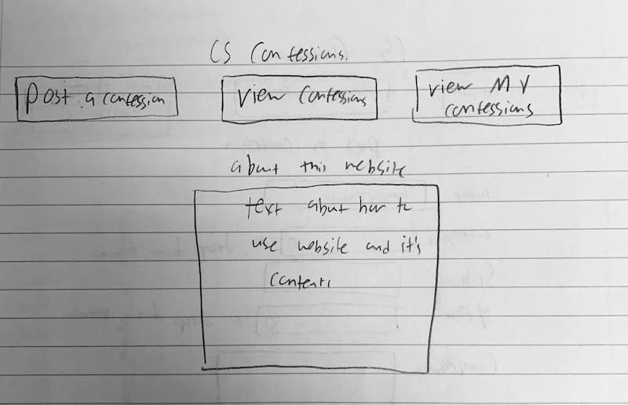
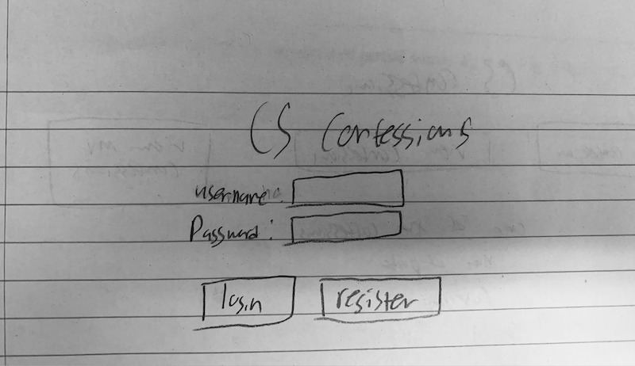
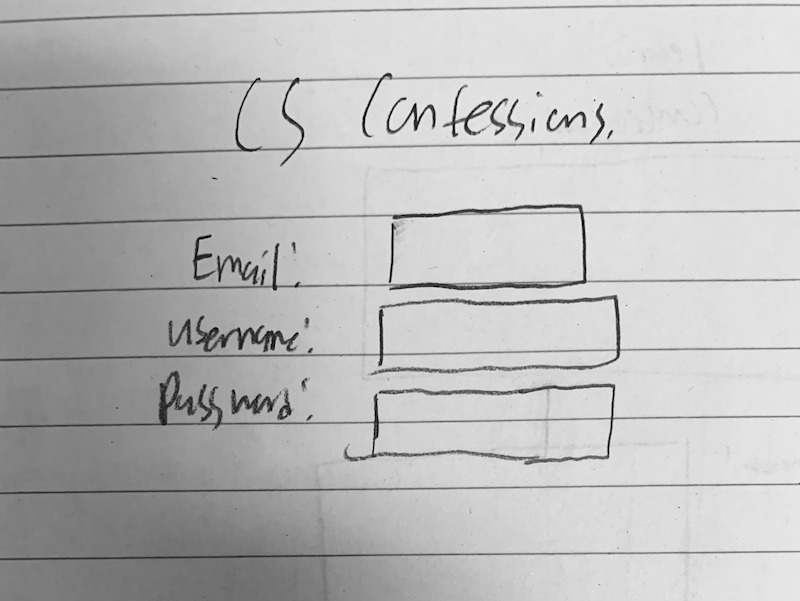
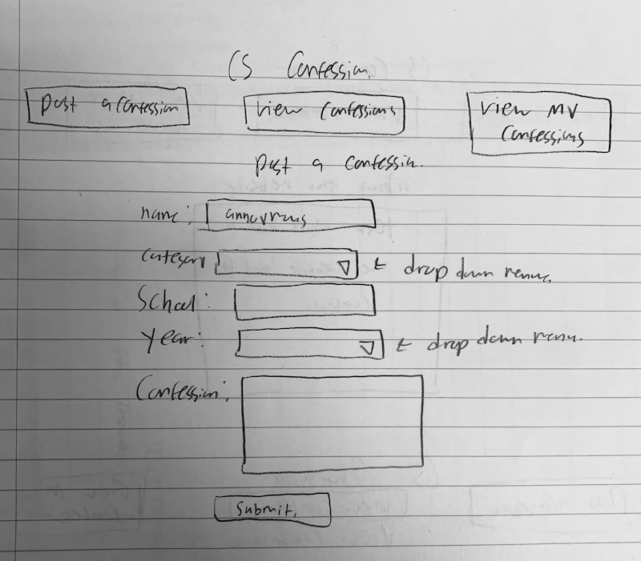
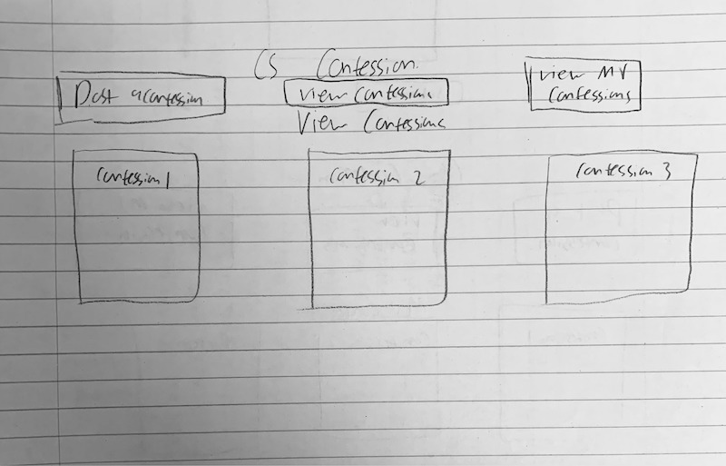
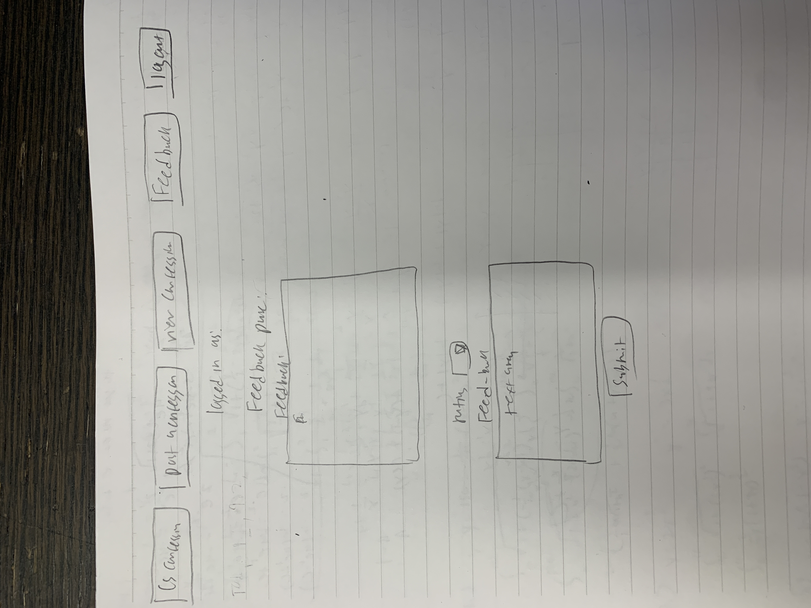
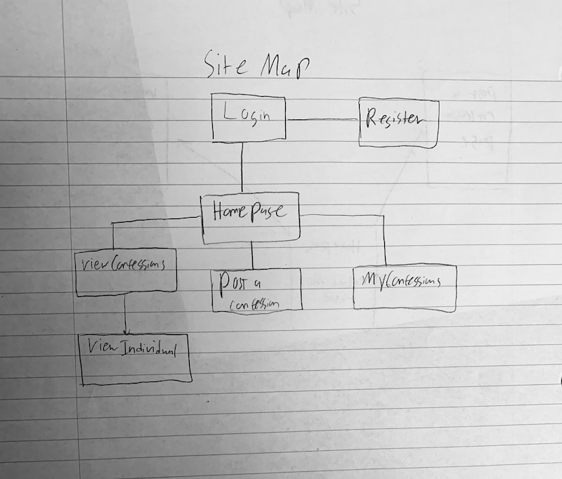

The content below is an example project proposal / requirements document. Replace the text below the lines marked "**TODO**" with details specific to your project. Remove the "TODO" lines.

# CS Confessions

## Overview

During your CS journey here at NYU, have you ever done anything embarrassing or did badly on a assignment, or bombed an exam? I know that during my time here pursuing computer science, the moments above always happened to me and continue to happen to me. So I wanted ot talk about it, especially ot my other classmates but found it hard when it seemed like everyone else around me was doing so much better. But I still wanted to talk about it, especially to others who could share like-minded experiences. I wanted to create a place where others could express their concerns or worries or rant in a safe place. Thus, that's where CS confessions Come in. CS confession is a web app that allows users to post a confession anonymously and view other confessions. Users can log in and register. Once they do, they can post their confessions and view other confessions. For every confession, they can add additional information if they want.

## Data Model

The application will store Users, Confessions and Confession information

- users can have multiple Confessions.
- each Confession can have comments.
- users can view other confessions.
- users can submit feedback about the website.

An Example User:

```javascript
{
  username: "CS_Student_1",
  password: // a password hash,
  lists: // an array of references to List documents
}
```

An Confession schema:

```javascript
{
  user: // a reference to a User object
  Confession_name: "I forogt how to iterate through an array during an interview.",
  Category: "Interviews",
  createdAt: // timestamp
  comments:[CommentSchema],
  slug: {type: String, slug: 'user', unique: true}
}
```
A feedback Schema: 

```javascript
{
  Rating: "1",
  feedback: "cool website"

}
```

An example of your confessios :

```javascript
{
  user: // a reference to a User object
  Confession_list: { {user: //a reference to a User object,
  Confession_name: "I forogt how to iterate through an array during an interview,"
  Category: "Interviews",
  School: "NYU",
  Year : "junior"} },

},

```

## [Link to Commented First Draft Schema](db.mjs)

(create a first draft of your Schemas in db.mjs and link to it)

## Wireframes

(: wireframes for all of the pages on your site; they can be as simple as photos of drawings or you can use a tool like Balsamiq, Omnigraffle, etc.)

/About - page explaining how to use website I would also like to note that I deleted the myConfession part of the website and instead was replaced by a feedback form.



/login - page for logging in



/register - page for registering as a user.



/about/PostConfession - page for posting a confession



/about/ViewAllConfessions - page for viewing all confessions



/about/feedback - page for posting feedback about the website 



## Site map

(draw out a site map that shows how pages are related to each other)

SiteMap: Note that I got rid of the MyConfession page and instead substituted a feedback Form. The professor said it was okay to just write this down rather than creating a whole new image. 



## User Stories or Use Cases

1. as non-registered user, I can register a new account with the site
2. as a user, I can log in to the site
3. as a user, I can create and post a confession
4. as a user, I can view other peoples confessions.
5. as a user, I can add comments to other peoples post
6. as a user, I can poost feedback about the website.

## Research Topics

the research topics that you're planning on working on along with their point values... and the total points of research topics listed


- (3 points) Perform client side form validation using custom JavaScript:

  - perform user validation to ensure that user is logged in or registered.
  - also validate to check that all the fields in the confesssion form are filled in.
  - will also ensure that users want to post the confession before actually posting it (in case they want to change any information.)
  - will also ensure that user when registering has an appropiate username and passowrd length. For example, user should have  a password that contains one uppercase letter, one number, and one special character. 
  - will prepare me for future cases in which I want to validate user.

  (5 points) use passport-js to integrate user loging and registration. 
  - use passport.js for user login and regsitration.
  - gave it 5 points since professor said it up to me us to decide based on how much work it took to integrate. 
  - honestly it took more work that I expected so I decided to give it 4 points 

- (2 points) will use either boostrap:
  - boostrap/tailwing are popular css frameworks used for responsive mobile friendly interface.
  - gives me a chance to explore other methods of styling comapred to the traditional way.
  - I also want my website to be mobile friendly.

10 points total out of 10 required points

## [Link to Initial Main Project File](app.mjs)

(create a skeleton Express application with a package.json, app.mjs, views folder, etc. ... and link to your initial app.mjs)

## Annotations / References Used

(list any tutorials/references/etc. that you've based your code off of)

1. [tutorial on bootstrap](https://www.youtube.com/watch?v=Jyvffr3aCp0) - (add link to source code that was based on this)
2. [bootstrap theme used] (https://startbootstrap.com/theme/landing-page)

